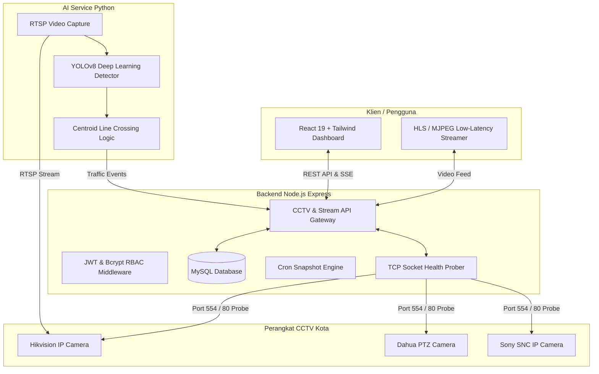

# 🌐 Smart City CCTV Surveillance & AI Traffic Monitoring System

[](https://react.dev/)
[](https://vitejs.dev/)
[](https://tailwindcss.com/)
[](https://nodejs.org/)
[](https://www.mysql.com/)
[](https://python.org/)
[](https://ultralytics.com/)
[](https://github.com/features/actions)

Sistem pemantauan CCTV kota terintegrasi dan analisis lalu lintas cerdas berbasis AI. Dirancang untuk pusat komando lalu lintas (*Traffic Management Center / TMC*), sistem ini menyediakan pemantauan multi-kamera real-time, deteksi kesehatan jaringan dan latensi otomatis, pencatatan histori *downtime*, rekap *snapshot* terjadwal, serta penghitungan volume kendaraan masuk/keluar batas kota secara otomatis menggunakan model **YOLOv8 + OpenCV**.

---

## 🚀 Live Demo Portofolio
> 🔗 **Akses Demo Interaktif:**  
> **[Kunjungi Live Demo di GitHub Pages](https://projectbyladzdzah.github.io/SmartCctvTraffic-monitor/)** *(Mode Demo Statis tanpa Backend)*
> 
> *Catatan: Untuk mencoba demo, klik tombol **"Mode Demo Portofolio (Akses Langsung)"** pada halaman login.*

---

## ✨ Fitur Unggulan

### 1. 📡 Multi-Camera Grid & Domain Sharding
- Tampilan grid multi-kamera responsif (2x2, 3x3, 4x4) dengan streaming RTSP-to-MJPEG berlatensi rendah.
- **Domain Sharding Architecture:** Memecah stream ke multiple host (`localhost` & `127.0.0.1`) untuk melipatgandakan batas koneksi simultan browser dari 6 menjadi 12+ stream aktif.

### 2. 🚦 AI Vehicle Counter (Batas Kota)
- Penghitungan volume kendaraan real-time (Mobil, Motor, Bus, Truk) dengan filter arah lintasan (*IN / OUT*).
- Ditenagai oleh model **YOLOv8n** dengan estimasi centroid tracking dan skip frame adaptif untuk kinerja optimal pada CPU/GPU.
- Visualisasi ringkasan statistik harian, grafik per jam, dan toggle kontrol aktivasi kamera.

### 3. ⚡ Telemetri Latensi & Health Check Real-time
- Ping probe berbasis socket TCP (Port 554 RTSP & Port 80 HTTP) untuk deteksi kondisi CCTV akurat tanpa ketergantungan ICMP OS.
- Pembaruan status visual otomatis (*Online / Offline / Degraded*) dengan indikator milidetik (ms).

### 4. ⏱️ Intelligent Downtime Logging
- Pencatatan otomatis jika CCTV mengalami gangguan (*offline* $\ge$ 10 menit).
- Merekam waktu mulai insiden, waktu pemulihan (*resolved*), total durasi, serta riwayat penanganan untuk audit SLA.

### 5. 📸 Automated Snapshot Recap & Export Excel
- Penjadwalan capture berkala (Pagi 06:00, Siang 12:00, Sore 19:00) dengan preview instan.
- Ekspor seluruh data inventaris dan rekap tampilan kamera ke format spreadsheet Excel (`.xlsx`).

### 6. 🛡️ Keamanan Enterprise & Role-Based Access Control (RBAC)
- Autentikasi berbasis **JSON Web Token (JWT)** dengan password hashing **Bcrypt**.
- Manajemen user bertingkat (*Admin* dan *Operator*) serta perlindungan *idle auto-logout*.

---

## 🏛️ Arsitektur Sistem



---

## 📁 Struktur Direktori

```text
├── .github/workflows/       # CI/CD otomatis deploy ke GitHub Pages
├── ai_service/              # Microservice AI Computer Vision (Python + YOLO)
│   ├── config.example.json  # Template konfigurasi kamera AI
│   ├── main.py              # Server AI & pipeline processing
│   ├── vehicle_counter.py   # Logika tracking & deteksi garis lintang
│   └── requirements.txt     # Dependensi Python
├── backend/                 # Backend Core API (Node.js + Express)
│   ├── .env.example         # Template konfigurasi environment
│   ├── database.js          # Inisialisasi pool MySQL & migrasi tabel otomatis
│   ├── server.js            # Entrypoint Express server
│   ├── routes/              # Endpoint REST API (Auth, CCTV, Stream, Counting)
│   └── services/            # Modul ping, stream transcoder, snapshot, excel
├── public/                  # Asset publik & template static
├── src/                     # Frontend Application (React 19 + Vite)
│   ├── components/          # Komponen UI modular (Grid, Modal, Recap, Table)
│   ├── context/             # AuthContext & Session Management
│   ├── hooks/               # Custom hooks (useCctvData, useTerminalPing)
│   └── services/            # API client & demo mode mock service
├── templates/               # Template import data CSV
└── package.json             # Dependensi & script build frontend
```

---

## 🛠️ Panduan Instalasi Lokal

### 1. Prasyarat
- **Node.js**: v18.x atau lebih baru
- **MySQL**: v8.x / MariaDB (XAMPP siap pakai)
- **Python**: v3.9+ (Opsional, untuk modul AI Vehicle Counter)

### 2. Konfigurasi Backend & Database
1. Buka folder `backend`:
   ```bash
   cd backend
   npm install
   ```
2. Salin template `.env.example` menjadi `.env`:
   ```bash
   copy .env.example .env
   ```
3. Sesuaikan koneksi database di `.env` jika diperlukan (database `cctv_db` dan tabel dibuat otomatis saat server pertama kali start).

### 3. Konfigurasi Frontend
1. Kembali ke root proyek:
   ```bash
   npm install
   npm run build
   ```

### 4. Menjalankan Server
Jalankan server pemantauan melalui script batch Windows:
```bash
start_server.bat
```
Atau secara manual:
```bash
cd backend
node server.js
```
Akses dashboard di browser: **`http://localhost:5000`**  
- **Username Default**: `admin`  
- **Password Default**: `admin123`

---

## 📄 Lisensi
Didistribusikan di bawah lisensi MIT. Lihat file `LICENSE` untuk rincian lebih lanjut.
